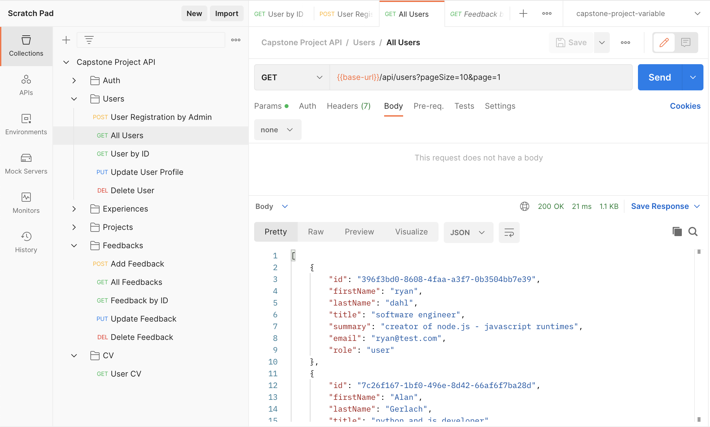

# DevConnect

DevConnect is a minimalistic social network designed for developers. It provides a platform for developers to showcase their experience, commercial and sandbox projects. The application offers features for user registration, login, portfolio creation, project management, feedback exchange, and custom CV generation.

Key Features:

1. User Registration and Login: Users can create an account and log in to access the platform's features.
2. Portfolio Creation: Users can build their professional portfolio by adding their work experience, commercial projects, and sandbox projects.
3. Project Management: Users can manage their projects, including adding project image, details, updating progress, and showcasing their contributions.
4. Feedback Exchange: Users can leave feedback and reviews for other developers, fostering a collaborative and supportive community.
5. Custom CV Generation: The application generates a customized CV based on the user's portfolio and feedback.

## Technologies used

- **[Node.js](https://nodejs.org/en/)** - As an asynchronous event-driven JavaScript runtime, Node.js is designed to build scalable network applications.
- **[TypeScript](https://www.typescriptlang.org/)** - Is a strongly typed programming language that builds on JavaScript.
- **[Express](https://expressjs.com/)** – Express is a minimal and flexible Node.js web application framework.
- **[MySQL](https://www.mysql.com/)** - Is an open-source relational database management system.
- **[Sequelize](https://sequelize.org/)** - Modern TypeScript and Node.js ORM.
- And other requirements which are in the package.json file.

## Local development

The project comes with a basic configuration for local start. App uses Docker to run MySQL and Redis.

> Get the code

```bash
git clone https://gitlab.com/chkvdm/capstone-project.git
cd capstone-project
```

> Install all package and requiremets.

```bash
npm install
```

> Start the MySQL and Redis.

```bash
docker compose up --build
```

> Database migration.

```bash
npm run migrations:dev:up
```

> Start the app

```bash
npm run start
```

## Testing

The project includes a complete collection of postman HTTP requests and almost 100 e2e tests for all API endpoints.
You can imported postman collection [from](./postman).

> Test API with postman collection.



> Start e2e testing.

```bash
npm run test
```

## License

[](https://opensource.org/licenses/MIT)
